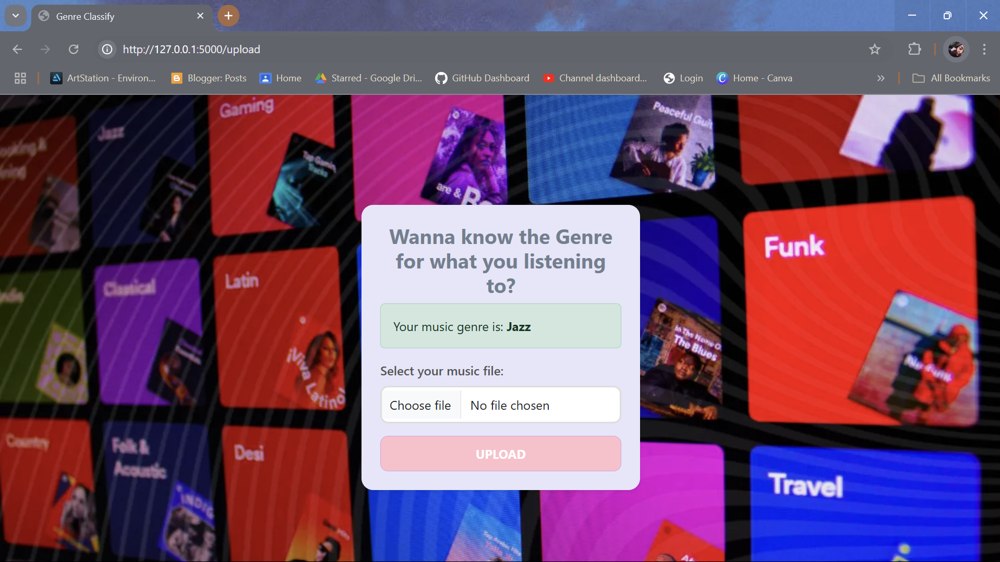

# Project: Music-Genre-Classification
Approach: Classify the audio file from 10 given genres using CNN trained model
- Mel- spectograms: to extract feature (imp) from audio signal, visual repre of audio signal. Shows how energy of the signal is distributed over diff freq over time but the freq scale is transformed so that it matches human sound perceiving nature. X-axis is time and Y-axis is frequency. Then fed it to CNN and train. So, our challenge is to extract the important feature and build a mel-spectogram.

- CNN: CNN are basically used in image related problems, time-series analysis, text classification, etc. It is part of Deep Learning and is used to deal with image dataset and then train our model to classify the images. CNN is divided into three process: Convolution, Pooling and Fully-Connected.

# Project Environment
-	We are working on Anaconda Prompt:

-	Go inside the project directory from anaconda

-   install all the requirements through this file
```
pip install -r requirements.txt
```

-   create a compatible environment
```
conda create --name <your_env_name> python=3.10 -y
```

-   Now the environment is created and we are ready to go with our application
-   Interact through Jupyter-Notebook by opening notebook through anaconda prompt

# Get the dataset:
-	From Kaggle: https://www.kaggle.com/datasets/andradaolteanu/gtzan-dataset-music-genre-classification/data

#  To use Colab for the project ML implementation:
-   Sign in to Colab with your gmail account
-	Upload dataset folder, requirements.txt, and rest of files to your drive inside MGC folder.
-	Give access to drive
-   Run the .ipynb files

#  (To solely use the application) How to use the flask app:
-   Clone the git repo to VSCode application
-	Use python terminal, activate conda env, install flask
-   run the commands:
```
conda activate <your_env_name>
```
flask run
-	http://127.0.0.1:5000  go to this port
-	Then, it should show below page:


-	Give your audio input to the application through “Choose file” button
-	Then you easily get your prediction as:


